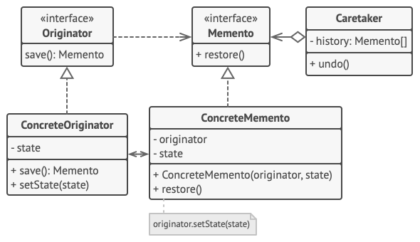

# Memento Design Pattern

## Definition

Memento is a behavioral design pattern that lets you save and restore the previous state of an object without revealing the details of its implementation.

## Example
### Graphics editor with history

Editor class is serialized and kept with Memento instance. History object contains all the previous steps and if needed can deserialized and state of drawings restored. Also redo() option is available.

## Other

- Example is from awesome website [Refactoring Guru](https://refactoring.guru)

